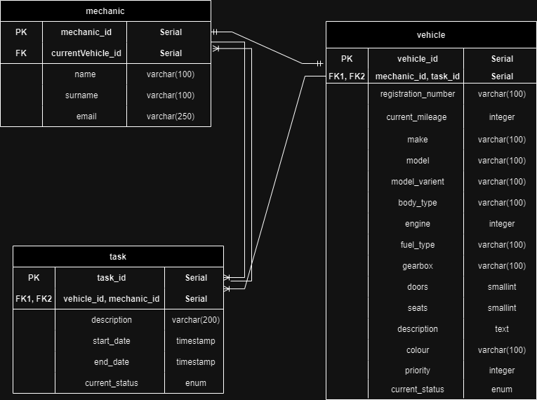

# Car Trader Project

This project is meant to be a continuation from my task. I'll be showing how to set up a Spring Boot application
with Postgres and creating relationships between tables. We go through One-to-Many, Many-to-one and One-to-One relationships. Also, this is a good way to practice and get familiar with the Spring Framework.

Diagram of Car Trader Database:


## How to run the service locally
**NOTE**: replace docker_name, username_name, user_password according to your needs.
* First we need to pull the latest Postgres public image that is available on Docker Hub.
  ```bash
  docker pull postgres
  ```
* Run the Docker container using the postgres:latest image. This will also create a database using the username as its name.
  ```bash
  docker run --name docker_name -e POSTGRES_USER=username_name -e POSTGRES_PASSWORD=user_password -p 5432:5432 -d postgres
  ```
* Access the database container.
    ```bash
    docker exec -it docker_name /bin/bash
    ```
* Connect to PostgresSQL database.
    ```bash
    psql -U username_name
    ```

* From IntelliJ connect to the newly created database
    * IntelliJ -> Database
        * Make sure to include your Port, User, Password and Database.
        * After test your connection with the database.
          
* In application.properties set the following:
    * src -> main -> resources -> application.properties
  ```java
  spring.datasource.url=jdbc:postgresql://localhost:container_port/databse_name
  spring.datasource.username=username_name
  spring.datasource.password=user_password
  ```
* To utilise TLS/SSL you need to grab SSL_Config folder and paste it into your desired IDE(ex pycharm). When running generateCertificates.py all the certificates will be auto generated for you.
    * After running this script you'll see all the certificates in the same directory.
    * Grab the pem file and import it into your browser.
    * Grab the p12 file, go back to CarTrader project and put it in src -> main -> resources -> keystore
    * In applications.properties add your p12 file.
      

## Endpoints(Work In Progress)
* If you are using Postman go to docs -> Tipico_Task.postman_collection.json and import the endpoints.

| Method | Endpoint                                          | Description                                                       |
|--------|---------------------------------------------------|-------------------------------------------------------------------|
| POST   | /setup                                            | Sets up the application by populating the database                |
| GET    | /tasks/{taskId}                                   | Get task                                                          |
| GET    | /tasks                                            | Get all tasks                                                     |
| POST   | /tasks                                            | Create task (NOTE: a raw body in JSON format need to be added)    |
| DELETE | /tasks/{taskId}                                   | Delete task                                                       |
| PUT    | /tasks/{taskId}                                   | Update task (NOTE: Query parameters need to be added              |


* Task raw JSON body example:
  ```java
  {
    "description":"Needs oil change",
    "start_date":"02/02/2024",
    "end_date":"03/02/2024",
    "current_status":"DONE"
  }
  ```
* Vehicle raw JSON body example:
  ```java
  {
  "registration_number": "bmw-117",
  "current_mileage": 20000,
  "make": "BMW",
  "model": "M4",
  "model_varient": "Competition Pack",
  "body_type": "Coupe",
  "engine": 2998,
  "fuel_type": "Petrol",
  "gearbox": "DCT",
  "colour": "Ferrari Red",
  "doors": 2,
  "seats": 4,
  "description": "A driver's car"
  }
  ```
* Mechanic raw JSON body example:
  ```java
  {
  "name": "Reuben",
  "surname":"Xuereb",
  "email":"reu@gmail.com",
  }
  ```
## Prerequisites
- Java 17
- Maven (latest version)
- Docker
- Postgres